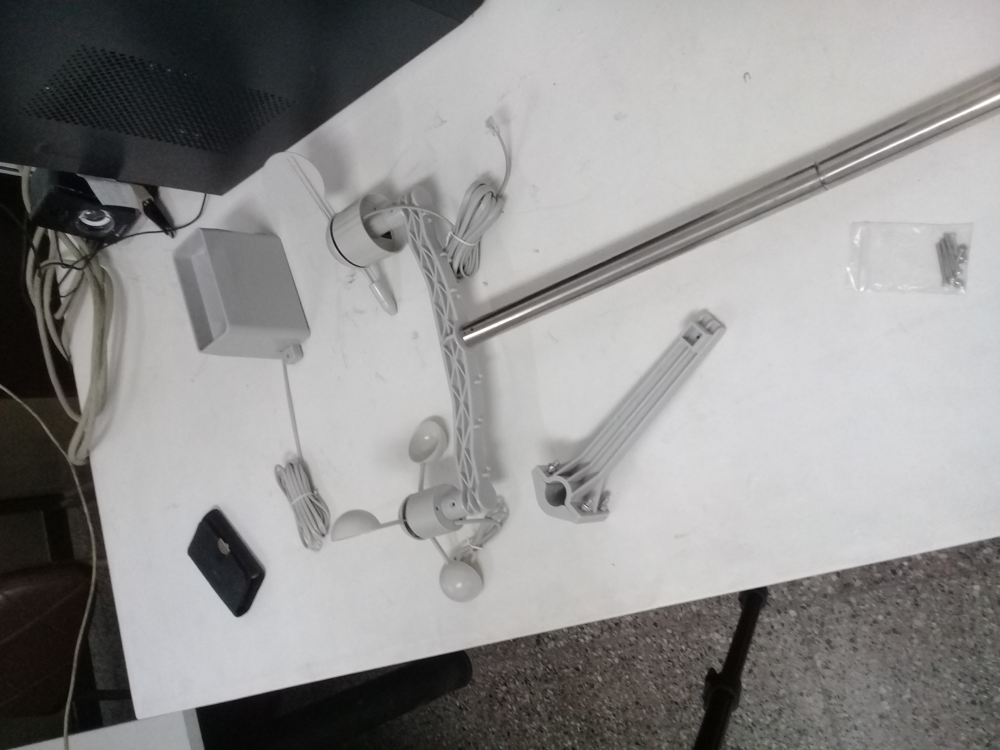
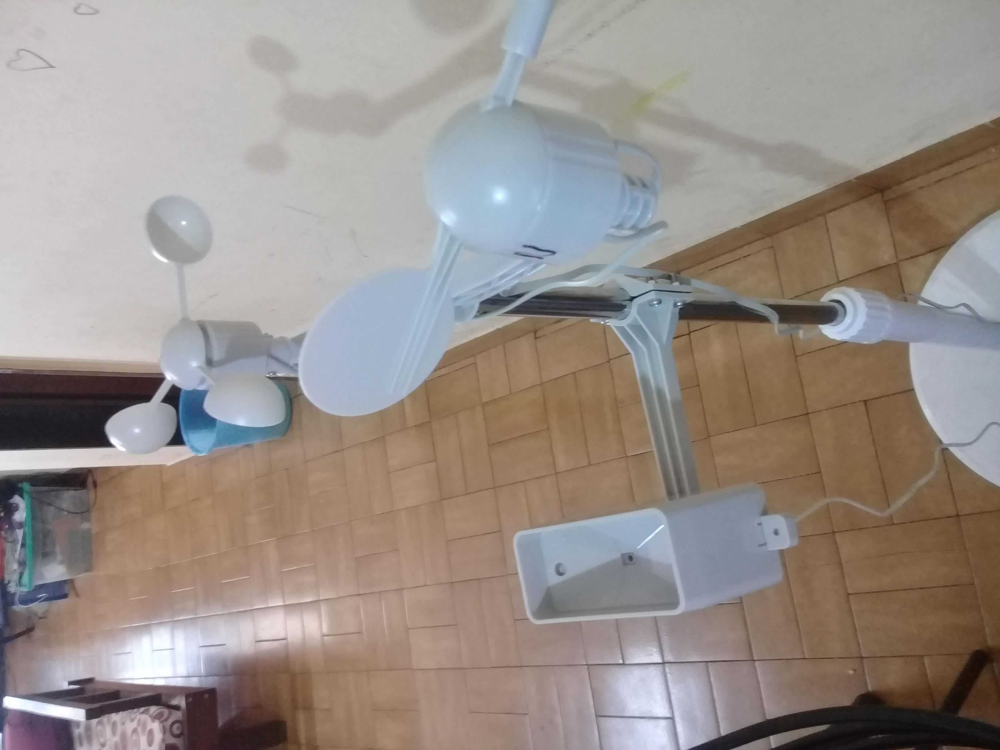
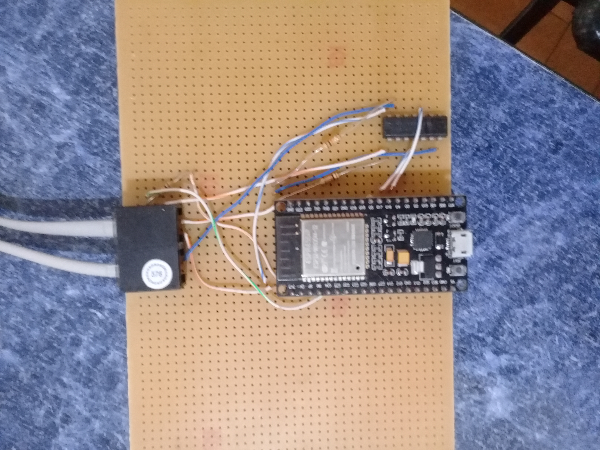

Estacion Meteorologica conectada a la nube con ESP32
============= 
Lectura de anemometro, pluviometro y veleta para estacion meteorologica con conexion a nube ThingSpeak

Este proyecto está realizado para poder leer, interpretar los datos, y subirlos a la nube con una placa de desarrollo ESP32. Por ahora la placa fue realizado en un PCB de prototipado, el siguiente paso sería realizar una pcb con la alimentación por baterías recargables o 5V, y otro paso sería agregar más sensores Como por ejemplo de temperatura y humedad, presión barométrica, etc. Cómo adquirimos solo los sensores de la estación meteorológica y no había librerías disponibles tuvimos que realizar todo el código en el Arduino IDE utilizando las interrupciones externas y conversores analógico digital para el caso de la veleta. El producto que adquirimos se encuentra en el siguiente link:

[Sensores Estacion Meteorologica](https://dynamoelectronics.com/tienda/kit-medidor-meteorologico/)

Como estos sensores tienen conexión a ficha RJ11 se decidió conseguir la respectiva ficha hembra para poderlos conectar al microcontrolador. Si no tienen fichas hembra de RJ11 podrían cortar el cable y soldarlo directamente a la placa.
Para poder usar la conexión a ThingSpeak se deberá descargar la librería correspondiente en el Arduino IDE. Una recomendación a la hora de elegir los GPIO del ESP32 es verificar en el modelo que se tiene cuáles fines están afectados durante el reinicio. Algunos GPIO cambien de estado HIGH o salida PPWM durante el reinicio de la placa. Esto puede generar problemas y resultados inesperados durante el arranque o incluso impedir el reinicio de la placa. Los pines que modifican así su estado son los siguientes:
- GPIO 1
- GPIO 3
- GPIO 5
- GPIO 6 to GPIO 11
- GPIO 14
- GPIO 15 
Este microcontrolador dispone de canales de entrada ADC de 18 x 12 bits. Los siguientes GPIO que se pueden usar como ADC:
- ADC1_CH0 (GPIO 36)
- ADC1_CH1 (GPIO 37)
- ADC1_CH2 (GPIO 38)
- ADC1_CH3 (GPIO 39)
- ADC1_CH4 (GPIO 32)
- ADC1_CH5 (GPIO 33)
- ADC1_CH6 (GPIO 34)
- ADC1_CH7 (GPIO 35)
- ADC2_CH0 (GPIO 4)
- ADC2_CH1 (GPIO 0)
- ADC2_CH2 (GPIO 2)
- ADC2_CH3 (GPIO 15)
- ADC2_CH4 (GPIO 13)
- ADC2_CH5 (GPIO 12)
- ADC2_CH6 (GPIO 14)
- ADC2_CH7 (GPIO 27)
- ADC2_CH8 (GPIO 25)
- ADC2_CH9 (GPIO 26) 
Si se va a utilizar la conexión por wi-fi se recomienda solo utilizar el ADC1

A continuacion se pueden ver imagenes del proyecto: 

)
